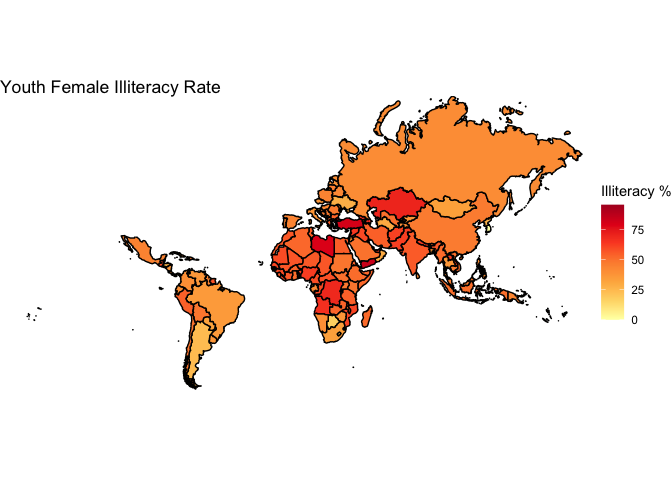
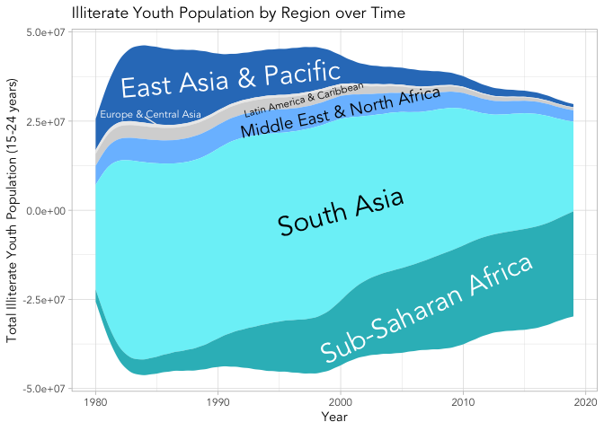

Gender Illiteracy
================
Shray Dewan
2023-09-03

``` r
gen <- read.csv("~/Documents/Documents/graphs for good/genderineq/youth_illiteracy (2).csv")
coun <- read.csv("~/Documents/Documents/graphs for good/genderineq/Gender_Stats_CSV/Gender_StatsCountry.csv")
```

``` r
library(tidyverse)
```

    ## ── Attaching core tidyverse packages ──────────────────────── tidyverse 2.0.0 ──
    ## ✔ dplyr     1.1.3     ✔ readr     2.1.4
    ## ✔ forcats   1.0.0     ✔ stringr   1.5.0
    ## ✔ ggplot2   3.4.3     ✔ tibble    3.2.1
    ## ✔ lubridate 1.9.2     ✔ tidyr     1.3.0
    ## ✔ purrr     1.0.2     
    ## ── Conflicts ────────────────────────────────────────── tidyverse_conflicts() ──
    ## ✖ dplyr::filter() masks stats::filter()
    ## ✖ dplyr::lag()    masks stats::lag()
    ## ℹ Use the conflicted package (<http://conflicted.r-lib.org/>) to force all conflicts to become errors

``` r
library(ggplot2)
library(biscale)
library(mapproj)
```

    ## Loading required package: maps
    ## 
    ## Attaching package: 'maps'
    ## 
    ## The following object is masked from 'package:purrr':
    ## 
    ##     map

``` r
library(tidyr)
library(reshape)
```

    ## 
    ## Attaching package: 'reshape'
    ## 
    ## The following object is masked from 'package:lubridate':
    ## 
    ##     stamp
    ## 
    ## The following object is masked from 'package:dplyr':
    ## 
    ##     rename
    ## 
    ## The following objects are masked from 'package:tidyr':
    ## 
    ##     expand, smiths

``` r
library(cowplot)
```

    ## 
    ## Attaching package: 'cowplot'
    ## 
    ## The following object is masked from 'package:reshape':
    ## 
    ##     stamp
    ## 
    ## The following object is masked from 'package:lubridate':
    ## 
    ##     stamp

``` r
library(dplyr)
library(streamgraph)
library(ggstream)
library(gh)
world_map <- map_data("world")
```

# Choropleth

``` r
gen1 <- full_join(gen,world_map,by=c("Country.Name"="region"))
```

    ## Warning in full_join(gen, world_map, by = c(Country.Name = "region")): Detected an unexpected many-to-many relationship between `x` and `y`.
    ## ℹ Row 161 of `x` matches multiple rows in `y`.
    ## ℹ Row 11 of `y` matches multiple rows in `x`.
    ## ℹ If a many-to-many relationship is expected, set `relationship =
    ##   "many-to-many"` to silence this warning.

``` r
gen1 <- filter(gen1, Indicator.Name == "Youth illiterate population, 15-24 years, % female")
gen_names <- levels(as.factor(gen$Country.Name))
map_names <- levels(as.factor(world_map$region))
map_names[which( !(map_names %in% gen_names) )]
```

    ##   [1] "Andorra"                            
    ##   [2] "Anguilla"                           
    ##   [3] "Antarctica"                         
    ##   [4] "Antigua"                            
    ##   [5] "Ascension Island"                   
    ##   [6] "Australia"                          
    ##   [7] "Austria"                            
    ##   [8] "Azores"                             
    ##   [9] "Bahamas"                            
    ##  [10] "Barbuda"                            
    ##  [11] "Belgium"                            
    ##  [12] "Bermuda"                            
    ##  [13] "Bonaire"                            
    ##  [14] "Brunei"                             
    ##  [15] "Canada"                             
    ##  [16] "Canary Islands"                     
    ##  [17] "Cape Verde"                         
    ##  [18] "Chagos Archipelago"                 
    ##  [19] "Christmas Island"                   
    ##  [20] "Cocos Islands"                      
    ##  [21] "Cook Islands"                       
    ##  [22] "Curacao"                            
    ##  [23] "Czech Republic"                     
    ##  [24] "Democratic Republic of the Congo"   
    ##  [25] "Denmark"                            
    ##  [26] "Djibouti"                           
    ##  [27] "Dominica"                           
    ##  [28] "Egypt"                              
    ##  [29] "Falkland Islands"                   
    ##  [30] "Faroe Islands"                      
    ##  [31] "Finland"                            
    ##  [32] "France"                             
    ##  [33] "French Guiana"                      
    ##  [34] "French Polynesia"                   
    ##  [35] "French Southern and Antarctic Lands"
    ##  [36] "Gambia"                             
    ##  [37] "Germany"                            
    ##  [38] "Greenland"                          
    ##  [39] "Grenadines"                         
    ##  [40] "Guadeloupe"                         
    ##  [41] "Guernsey"                           
    ##  [42] "Heard Island"                       
    ##  [43] "Iceland"                            
    ##  [44] "Iran"                               
    ##  [45] "Ireland"                            
    ##  [46] "Isle of Man"                        
    ##  [47] "Ivory Coast"                        
    ##  [48] "Japan"                              
    ##  [49] "Jersey"                             
    ##  [50] "Kiribati"                           
    ##  [51] "Kosovo"                             
    ##  [52] "Kyrgyzstan"                         
    ##  [53] "Laos"                               
    ##  [54] "Liechtenstein"                      
    ##  [55] "Luxembourg"                         
    ##  [56] "Madeira Islands"                    
    ##  [57] "Martinique"                         
    ##  [58] "Mayotte"                            
    ##  [59] "Micronesia"                         
    ##  [60] "Monaco"                             
    ##  [61] "Montserrat"                         
    ##  [62] "Nauru"                              
    ##  [63] "Netherlands"                        
    ##  [64] "Nevis"                              
    ##  [65] "New Zealand"                        
    ##  [66] "Niue"                               
    ##  [67] "Norfolk Island"                     
    ##  [68] "North Korea"                        
    ##  [69] "Northern Mariana Islands"           
    ##  [70] "Norway"                             
    ##  [71] "Palestine"                          
    ##  [72] "Pitcairn Islands"                   
    ##  [73] "Republic of Congo"                  
    ##  [74] "Reunion"                            
    ##  [75] "Russia"                             
    ##  [76] "Saba"                               
    ##  [77] "Saint Barthelemy"                   
    ##  [78] "Saint Helena"                       
    ##  [79] "Saint Kitts"                        
    ##  [80] "Saint Lucia"                        
    ##  [81] "Saint Martin"                       
    ##  [82] "Saint Pierre and Miquelon"          
    ##  [83] "Saint Vincent"                      
    ##  [84] "Siachen Glacier"                    
    ##  [85] "Sint Eustatius"                     
    ##  [86] "Sint Maarten"                       
    ##  [87] "Slovakia"                           
    ##  [88] "Solomon Islands"                    
    ##  [89] "South Georgia"                      
    ##  [90] "South Korea"                        
    ##  [91] "South Sandwich Islands"             
    ##  [92] "Swaziland"                          
    ##  [93] "Sweden"                             
    ##  [94] "Switzerland"                        
    ##  [95] "Syria"                              
    ##  [96] "Taiwan"                             
    ##  [97] "Tobago"                             
    ##  [98] "Trinidad"                           
    ##  [99] "Turkey"                             
    ## [100] "Turks and Caicos Islands"           
    ## [101] "UK"                                 
    ## [102] "USA"                                
    ## [103] "Vatican"                            
    ## [104] "Venezuela"                          
    ## [105] "Virgin Islands"                     
    ## [106] "Wallis and Futuna"                  
    ## [107] "Western Sahara"                     
    ## [108] "Yemen"

``` r
gen_names[which( !(gen_names %in% map_names) )]
```

    ##  [1] "Arab World"                                        
    ##  [2] "Brunei Darussalam"                                 
    ##  [3] "Cabo Verde"                                        
    ##  [4] "Caribbean small states"                            
    ##  [5] "Central Europe and the Baltics"                    
    ##  [6] "Congo, Dem. Rep."                                  
    ##  [7] "Congo, Rep."                                       
    ##  [8] "Cote d'Ivoire"                                     
    ##  [9] "Czechia"                                           
    ## [10] "Early-demographic dividend"                        
    ## [11] "East Asia & Pacific"                               
    ## [12] "East Asia & Pacific (excluding high income)"       
    ## [13] "East Asia & Pacific (IDA & IBRD)"                  
    ## [14] "Egypt, Arab Rep."                                  
    ## [15] "Eswatini"                                          
    ## [16] "Europe & Central Asia"                             
    ## [17] "Europe & Central Asia (excluding high income)"     
    ## [18] "Europe & Central Asia (IDA & IBRD)"                
    ## [19] "Fragile and conflict affected situations"          
    ## [20] "Gambia, The"                                       
    ## [21] "Heavily indebted poor countries (HIPC)"            
    ## [22] "IBRD only"                                         
    ## [23] "IDA & IBRD total"                                  
    ## [24] "IDA blend"                                         
    ## [25] "IDA only"                                          
    ## [26] "IDA total"                                         
    ## [27] "Iran, Islamic Rep."                                
    ## [28] "Korea, Dem. People's Rep."                         
    ## [29] "Korea, Rep."                                       
    ## [30] "Kyrgyz Republic"                                   
    ## [31] "Lao PDR"                                           
    ## [32] "Late-demographic dividend"                         
    ## [33] "Latin America & Caribbean"                         
    ## [34] "Latin America & Caribbean (excluding high income)" 
    ## [35] "Latin America & Caribbean (IDA & IBRD)"            
    ## [36] "Least developed countries: UN classification"      
    ## [37] "Low & middle income"                               
    ## [38] "Low income"                                        
    ## [39] "Lower middle income"                               
    ## [40] "Macao SAR, China"                                  
    ## [41] "Middle East & North Africa"                        
    ## [42] "Middle East & North Africa (excluding high income)"
    ## [43] "Middle East & North Africa (IDA & IBRD)"           
    ## [44] "Middle income"                                     
    ## [45] "Other small states"                                
    ## [46] "Pacific island small states"                       
    ## [47] "Pre-demographic dividend"                          
    ## [48] "Russian Federation"                                
    ## [49] "Small states"                                      
    ## [50] "South Asia"                                        
    ## [51] "South Asia (IDA & IBRD)"                           
    ## [52] "St. Vincent and the Grenadines"                    
    ## [53] "Sub-Saharan Africa"                                
    ## [54] "Sub-Saharan Africa (excluding high income)"        
    ## [55] "Sub-Saharan Africa (IDA & IBRD)"                   
    ## [56] "Syrian Arab Republic"                              
    ## [57] "Trinidad and Tobago"                               
    ## [58] "Turkiye"                                           
    ## [59] "Upper middle income"                               
    ## [60] "Venezuela, RB"                                     
    ## [61] "West Bank and Gaza"                                
    ## [62] "World"                                             
    ## [63] "Yemen, Rep."

``` r
gen <- mutate(gen,Country.Name=fct_recode(Country.Name,
                                                "Brunei"="Brunei Darussalam",
                                                "Cape Verde"="Cabo Verde",
                                                "Democratic Republic of the Congo"="Congo, Dem. Rep.",
                                                "Republic of Congo"="Congo, Rep.",
                                                "Czech Republic"="Czechia",
                                                "Ivory Coast"="Cote d'Ivoire",
                                                "Egypt"="Egypt, Arab Rep.",
                                                "Swaziland"="Eswatini",
                                                "Gambia"="Gambia, The",
                                                "Iran"="Iran, Islamic Rep.",
                                                "North Korea"="Korea, Dem. People's Rep.",
                                                "South Korea"="Korea, Rep.",
                                                "Kyrgyzstan"="Kyrgyz Republic",
                                                "Laos"="Lao PDR",
                                                "Russia"="Russian Federation",
                                                "Saint Vincent"="St. Vincent and the Grenadines",
                                                "Syria"="Syrian Arab Republic",
                                                "Trinidad"="Trinidad and Tobago",
                                                "Turkey"="Turkiye",
                                                "Venezuela"="Venezuela, RB",
                                                "Yemen"="Yemen, Rep."
                                                ))
gen1 <- full_join(gen,world_map,by=c("Country.Name"="region"))
```

    ## Warning in full_join(gen, world_map, by = c(Country.Name = "region")): Detected an unexpected many-to-many relationship between `x` and `y`.
    ## ℹ Row 161 of `x` matches multiple rows in `y`.
    ## ℹ Row 11 of `y` matches multiple rows in `x`.
    ## ℹ If a many-to-many relationship is expected, set `relationship =
    ##   "many-to-many"` to silence this warning.

``` r
gen1 <- gen1 %>% drop_na(long)
```

``` r
gen1 <- filter(gen1, Indicator.Name == "Youth illiterate population, 15-24 years, % female")
```

``` r
chor1 <- ggplot(gen1, aes(x=long,y=lat,group=group,fill=last))+ 
  geom_polygon(color="black")+
  geom_polygon(data=filter(gen1,Country.Name=="Lesotho"),color="black")+
  coord_map(xlim=c(-180,180),ylim=c(-55,90))+
  theme_void()+
  labs(title="Youth Female Illiteracy Rate", fill="Illiteracy %")
chor1 +
  scale_fill_distiller(palette = "YlOrRd",direction=1)
```

<!-- -->

# Choropleth 2

``` r
gen2 <- gen
head(gen2)
```

    ##      X           Country.Name Country.Code
    ## 1 3455             Arab World          ARB
    ## 2 3456             Arab World          ARB
    ## 3 3457             Arab World          ARB
    ## 4 3458             Arab World          ARB
    ## 5 4608 Caribbean small states          CSS
    ## 6 4609 Caribbean small states          CSS
    ##                                                  Indicator.Name
    ## 1            Youth illiterate population, 15-24 years, % female
    ## 2 Youth illiterate population, 15-24 years, both sexes (number)
    ## 3     Youth illiterate population, 15-24 years, female (number)
    ## 4       Youth illiterate population, 15-24 years, male (number)
    ## 5            Youth illiterate population, 15-24 years, % female
    ## 6 Youth illiterate population, 15-24 years, both sexes (number)
    ##     Indicator.Code X1970 X1971 X1972 X1973 X1974 X1975 X1976        X1977
    ## 1  UIS.LPP.AG15T24    NA    NA    NA    NA    NA    NA    NA 6.395826e+01
    ## 2   UIS.LP.AG15T24    NA    NA    NA    NA    NA    NA    NA 1.125482e+07
    ## 3 UIS.LP.AG15T24.F    NA    NA    NA    NA    NA    NA    NA 7.198389e+06
    ## 4 UIS.LP.AG15T24.M    NA    NA    NA    NA    NA    NA    NA 4.056434e+06
    ## 5  UIS.LPP.AG15T24    NA    NA    NA    NA    NA    NA    NA           NA
    ## 6   UIS.LP.AG15T24    NA    NA    NA    NA    NA    NA    NA           NA
    ##          X1978        X1979        X1980        X1981        X1982        X1983
    ## 1 6.379572e+01 6.364966e+01 6.356420e+01 6.353464e+01 6.354282e+01 6.410282e+01
    ## 2 1.154977e+07 1.183475e+07 1.207670e+07 1.226115e+07 1.240546e+07 1.256926e+07
    ## 3 7.368259e+06 7.532777e+06 7.676459e+06 7.790078e+06 7.882777e+06 8.057252e+06
    ## 4 4.181511e+06 4.301970e+06 4.400243e+06 4.471074e+06 4.522679e+06 4.512012e+06
    ## 5           NA           NA           NA           NA           NA           NA
    ## 6           NA           NA           NA           NA           NA           NA
    ##          X1984        X1985        X1986        X1987        X1988        X1989
    ## 1 6.419182e+01 6.428201e+01 6.432852e+01 6.431683e+01 6.428617e+01 6.425268e+01
    ## 2 1.253525e+07 1.248104e+07 1.237894e+07 1.232456e+07 1.222366e+07 1.212880e+07
    ## 3 8.046608e+06 8.023062e+06 7.963193e+06 7.926764e+06 7.858120e+06 7.793076e+06
    ## 4 4.488647e+06 4.457975e+06 4.415752e+06 4.397792e+06 4.365536e+06 4.335719e+06
    ## 5           NA           NA           NA           NA           NA           NA
    ## 6           NA           NA           NA           NA           NA           NA
    ##          X1990        X1991        X1992        X1993        X1994        X1995
    ## 1 6.426675e+01 6.489065e+01 6.490176e+01 6.563913e+01 6.547124e+01 6.532609e+01
    ## 2 1.198716e+07 1.163718e+07 1.149218e+07 1.192562e+07 1.183247e+07 1.174390e+07
    ## 3 7.703759e+06 7.551443e+06 7.458627e+06 7.827875e+06 7.746867e+06 7.671831e+06
    ## 4 4.283402e+06 4.085739e+06 4.033553e+06 4.097747e+06 4.085607e+06 4.072069e+06
    ## 5           NA           NA           NA 3.363634e+01 3.359023e+01 3.375038e+01
    ## 6           NA           NA           NA 9.016800e+04 8.948400e+04 8.681500e+04
    ##          X1996        X1997        X1998        X1999        X2000        X2001
    ## 1 6.507053e+01 6.476532e+01 6.429488e+01 6.378942e+01 6.327826e+01 6.299000e+01
    ## 2 1.161291e+07 1.155160e+07 1.153447e+07 1.145753e+07 1.138166e+07 1.119071e+07
    ## 3 7.556584e+06 7.481430e+06 7.416074e+06 7.308692e+06 7.202116e+06 7.049028e+06
    ## 4 4.056329e+06 4.070170e+06 4.118397e+06 4.148838e+06 4.179544e+06 4.141681e+06
    ## 5 3.406982e+01 3.442079e+01 3.451732e+01 3.457509e+01 3.462693e+01 3.434581e+01
    ## 6 8.404900e+04 8.121900e+04 7.615100e+04 7.187900e+04 7.046900e+04 6.784200e+04
    ##          X2002        X2003        X2004        X2005        X2006        X2007
    ## 1 6.259999e+01 6.536462e+01 6.480171e+01 6.447836e+01 6.088436e+01 6.062031e+01
    ## 2 1.088718e+07 1.059442e+07 1.041431e+07 1.040321e+07 1.151922e+07 1.122748e+07
    ## 3 6.815373e+06 6.924999e+06 6.748649e+06 6.707820e+06 7.013402e+06 6.806130e+06
    ## 4 4.071806e+06 3.669417e+06 3.665658e+06 3.695392e+06 4.505815e+06 4.421346e+06
    ## 5 3.395826e+01 3.356940e+01 3.318415e+01 3.284915e+01 3.331131e+01 3.159206e+01
    ## 6 6.544600e+04 6.342200e+04 6.170200e+04 5.975400e+04 5.956900e+04 5.410500e+04
    ##          X2008        X2009        X2010        X2011        X2012        X2013
    ## 1 6.043429e+01 5.953780e+01 5.918875e+01 5.896962e+01 6.048713e+01 5.884385e+01
    ## 2 1.096350e+07 1.297068e+07 1.284114e+07 1.273414e+07 1.005425e+07 9.919306e+06
    ## 3 6.625711e+06 7.722455e+06 7.600511e+06 7.509272e+06 6.081525e+06 5.836902e+06
    ## 4 4.337785e+06 5.248221e+06 5.240630e+06 5.224864e+06 3.972721e+06 4.082404e+06
    ## 5 3.171571e+01 3.188082e+01 3.176778e+01 3.177528e+01 3.320270e+01 3.193443e+01
    ## 6 5.276800e+04 5.133800e+04 5.074300e+04 4.957700e+04 4.948100e+04 4.413800e+04
    ##          X2014        X2015        X2016        X2017        X2018        X2019
    ## 1 5.902092e+01 5.681433e+01 5.756398e+01 5.694649e+01 5.553667e+01 5.543160e+01
    ## 2 9.194449e+06 1.161947e+07 1.004871e+07 9.724633e+06 1.252652e+07 1.252786e+07
    ## 3 5.426649e+06 6.601525e+06 5.784437e+06 5.537838e+06 6.956813e+06 6.944396e+06
    ## 4 3.767800e+06 5.017946e+06 4.264272e+06 4.186795e+06 5.569708e+06 5.583469e+06
    ## 5 3.198022e+01 3.207964e+01 3.207964e+01 3.207964e+01 3.207964e+01 3.207964e+01
    ## 6 4.260700e+04 4.296600e+04 4.296600e+04 4.296600e+04 4.296600e+04 4.296600e+04
    ##           last
    ## 1 5.543160e+01
    ## 2 1.252786e+07
    ## 3 6.944396e+06
    ## 4 5.583469e+06
    ## 5 3.207964e+01
    ## 6 4.296600e+04

``` r
gen2 <- filter(gen2, Indicator.Name == "Youth illiterate population, 15-24 years, female (number)" | Indicator.Name == "Youth illiterate population, 15-24 years, male (number)")
gen2 <- gen2[,c(2,4,56)]
gen2 <- cast(gen2, Country.Name ~ Indicator.Name)
```

    ## Using last as value column.  Use the value argument to cast to override this choice

``` r
colnames(gen2)[2] ="Female"
colnames(gen2)[3] ="Male"
```

``` r
gen_names <- levels(as.factor(gen2$Country.Name))
map_names <- levels(as.factor(world_map$region))
map_names[which( !(map_names %in% gen_names) )]
```

    ##  [1] "Andorra"                             "Anguilla"                           
    ##  [3] "Antarctica"                          "Antigua"                            
    ##  [5] "Ascension Island"                    "Australia"                          
    ##  [7] "Austria"                             "Azores"                             
    ##  [9] "Bahamas"                             "Barbuda"                            
    ## [11] "Belgium"                             "Bermuda"                            
    ## [13] "Bonaire"                             "Canada"                             
    ## [15] "Canary Islands"                      "Chagos Archipelago"                 
    ## [17] "Christmas Island"                    "Cocos Islands"                      
    ## [19] "Cook Islands"                        "Curacao"                            
    ## [21] "Denmark"                             "Djibouti"                           
    ## [23] "Dominica"                            "Falkland Islands"                   
    ## [25] "Faroe Islands"                       "Finland"                            
    ## [27] "France"                              "French Guiana"                      
    ## [29] "French Polynesia"                    "French Southern and Antarctic Lands"
    ## [31] "Germany"                             "Greenland"                          
    ## [33] "Grenadines"                          "Guadeloupe"                         
    ## [35] "Guernsey"                            "Heard Island"                       
    ## [37] "Iceland"                             "Ireland"                            
    ## [39] "Isle of Man"                         "Japan"                              
    ## [41] "Jersey"                              "Kiribati"                           
    ## [43] "Kosovo"                              "Liechtenstein"                      
    ## [45] "Luxembourg"                          "Madeira Islands"                    
    ## [47] "Martinique"                          "Mayotte"                            
    ## [49] "Micronesia"                          "Monaco"                             
    ## [51] "Montserrat"                          "Nauru"                              
    ## [53] "Netherlands"                         "Nevis"                              
    ## [55] "New Zealand"                         "Niue"                               
    ## [57] "Norfolk Island"                      "Northern Mariana Islands"           
    ## [59] "Norway"                              "Palestine"                          
    ## [61] "Pitcairn Islands"                    "Reunion"                            
    ## [63] "Saba"                                "Saint Barthelemy"                   
    ## [65] "Saint Helena"                        "Saint Kitts"                        
    ## [67] "Saint Lucia"                         "Saint Martin"                       
    ## [69] "Saint Pierre and Miquelon"           "Siachen Glacier"                    
    ## [71] "Sint Eustatius"                      "Sint Maarten"                       
    ## [73] "Slovakia"                            "Solomon Islands"                    
    ## [75] "South Georgia"                       "South Sandwich Islands"             
    ## [77] "Sweden"                              "Switzerland"                        
    ## [79] "Taiwan"                              "Tobago"                             
    ## [81] "Turks and Caicos Islands"            "UK"                                 
    ## [83] "USA"                                 "Vatican"                            
    ## [85] "Virgin Islands"                      "Wallis and Futuna"                  
    ## [87] "Western Sahara"

``` r
gen_names[which( !(gen_names %in% map_names) )]
```

    ##  [1] "Arab World"                                        
    ##  [2] "Caribbean small states"                            
    ##  [3] "Central Europe and the Baltics"                    
    ##  [4] "Early-demographic dividend"                        
    ##  [5] "East Asia & Pacific"                               
    ##  [6] "East Asia & Pacific (excluding high income)"       
    ##  [7] "East Asia & Pacific (IDA & IBRD)"                  
    ##  [8] "Europe & Central Asia"                             
    ##  [9] "Europe & Central Asia (excluding high income)"     
    ## [10] "Europe & Central Asia (IDA & IBRD)"                
    ## [11] "Fragile and conflict affected situations"          
    ## [12] "Heavily indebted poor countries (HIPC)"            
    ## [13] "IBRD only"                                         
    ## [14] "IDA & IBRD total"                                  
    ## [15] "IDA blend"                                         
    ## [16] "IDA only"                                          
    ## [17] "IDA total"                                         
    ## [18] "Late-demographic dividend"                         
    ## [19] "Latin America & Caribbean"                         
    ## [20] "Latin America & Caribbean (excluding high income)" 
    ## [21] "Latin America & Caribbean (IDA & IBRD)"            
    ## [22] "Least developed countries: UN classification"      
    ## [23] "Low & middle income"                               
    ## [24] "Low income"                                        
    ## [25] "Lower middle income"                               
    ## [26] "Macao SAR, China"                                  
    ## [27] "Middle East & North Africa"                        
    ## [28] "Middle East & North Africa (excluding high income)"
    ## [29] "Middle East & North Africa (IDA & IBRD)"           
    ## [30] "Middle income"                                     
    ## [31] "Other small states"                                
    ## [32] "Pacific island small states"                       
    ## [33] "Pre-demographic dividend"                          
    ## [34] "Small states"                                      
    ## [35] "South Asia"                                        
    ## [36] "South Asia (IDA & IBRD)"                           
    ## [37] "Sub-Saharan Africa"                                
    ## [38] "Sub-Saharan Africa (excluding high income)"        
    ## [39] "Sub-Saharan Africa (IDA & IBRD)"                   
    ## [40] "Upper middle income"                               
    ## [41] "West Bank and Gaza"                                
    ## [42] "World"

``` r
gen2 <- left_join(gen2,world_map,by=c("Country.Name"="region"))
head(gen2)
```

    ##   Country.Name  Female    Male     long      lat group order subregion
    ## 1  Afghanistan 1715752 1075270 74.89131 37.23164     2    12      <NA>
    ## 2  Afghanistan 1715752 1075270 74.84023 37.22505     2    13      <NA>
    ## 3  Afghanistan 1715752 1075270 74.76738 37.24917     2    14      <NA>
    ## 4  Afghanistan 1715752 1075270 74.73896 37.28564     2    15      <NA>
    ## 5  Afghanistan 1715752 1075270 74.72666 37.29072     2    16      <NA>
    ## 6  Afghanistan 1715752 1075270 74.66895 37.26670     2    17      <NA>

``` r
bidata <- bi_class(gen2, x = Female, y = Male, style = "quantile", dim = 3)
bimap <- ggplot() +
  geom_polygon(bidata, mapping = aes(x=long, y=lat, group=group, fill = bi_class), color = "white", size = 0.1, show.legend = F) +
  geom_polygon(data=filter(bidata,Country.Name=="Lesotho"), mapping = aes(x=long, y=lat, group=group, fill = bi_class), color = "white", size = 0.1, show.legend = F) +
  bi_scale_fill(pal = "DkViolet", dim = 3) +
  coord_map(xlim=c(-180,180),ylim=c(-55,90))+
  labs(title = "Comparing Female to Male Youth Illiteracy",x="",y="") +
  bi_theme()
```

    ## Warning: Using `size` aesthetic for lines was deprecated in ggplot2 3.4.0.
    ## ℹ Please use `linewidth` instead.
    ## This warning is displayed once every 8 hours.
    ## Call `lifecycle::last_lifecycle_warnings()` to see where this warning was
    ## generated.

``` r
bilegend <- bi_legend(pal = "DkViolet",
                           dim = 3,
                           xlab = "Female Illiteracy",
                           ylab = "Male Illiteracy",
                           size = 8)
bifinmap <- ggdraw() +
  draw_plot(bimap, 0, 0, 1, 1)+
  draw_plot(bilegend, 0.1, 0.1, 0.2, 0.2)
bifinmap
```

<!-- -->

# Streamplot

``` r
gen3 <- filter(gen, Indicator.Name == "Youth illiterate population, 15-24 years, female (number)")
gen3 <- gen3[-c(1:40),-c(1,3:5,56)]
gen3 <- gather(gen3, Year, Illiterate.Population, X1970:X2019, factor_key=TRUE)
gen3$Year<-as.numeric(gsub("X","",gen3$Year))
gen3 <- na.omit(gen3[!is.na(gen3$Illiterate.Population), ])
```

``` r
gen3.1 <- filter(gen3, Illiterate.Population > 3000000)
```

``` r
coun2 <- coun[c(3,8,9)]
gen3.2 <- mutate(gen3,Country.Name=fct_recode(Country.Name,
                                                "Brunei Darussalam"="Brunei",
                                                "Cabo Verde"="Cape Verde",
                                                "Congo, Dem. Rep."="Democratic Republic of the Congo",
                                                "Congo, Rep."="Republic of Congo",
                                                "Czechia"="Czech Republic",
                                                "Cote d'Ivoire"="Ivory Coast",
                                                "Egypt, Arab Rep."="Egypt",
                                                "Eswatini"="Swaziland",
                                                "Gambia, The"="Gambia",
                                                "Iran, Islamic Rep."="Iran",
                                                "Korea, Dem. People's Rep."="North Korea",
                                                "Korea, Rep."="South Korea",
                                                "Kyrgyz Republic"="Kyrgyzstan",
                                                "Lao PDR"="Laos",
                                                "Russian Federation"="Russia",
                                                "St. Vincent and the Grenadines"="Saint Vincent",
                                                "Syrian Arab Republic"="Syria",
                                                "Trinidad and Tobago"="Trinidad",
                                                "Türkiye"="Turkey",
                                                "Venezuela, RB"="Venezuela",
                                                "Yemen, Rep."="Yemen",
                                              "Côte d'Ivoire" = "Cote d'Ivoire",
                                              "São Tomé and Principe"="Sao Tome and Principe"))
```

    ## Warning: There was 1 warning in `mutate()`.
    ## ℹ In argument: `Country.Name = fct_recode(...)`.
    ## Caused by warning:
    ## ! Unknown levels in `f`: Cote d'Ivoire

``` r
gen3.2 <- left_join(gen3.2,coun2,by=c("Country.Name"="Table.Name"))

gen3.2.1 <- gen3.2 %>%
  group_by(Region, Year) %>%
  summarize(Total.Population = sum(Illiterate.Population))
```

    ## `summarise()` has grouped output by 'Region'. You can override using the
    ## `.groups` argument.

``` r
gen3.2.1 <- na.omit(gen3.2.1)
  
ggplot(gen3.2.1, aes(x=Year,y=Total.Population,fill=Region)) +
  geom_stream()+
  theme_light()+
  labs(y = "Total Illiterate Youth Population (15-24 years)", 
       title = "Illiterate Youth Population by Region over Time")+
  scale_fill_manual(values = c("#307DC3", "#EBEBEB", "#D6D6D6", "#7ABFFF", "#79F1F8", "#30BBC3"))+
  theme(text = element_text(family = "Avenir"))+
  xlim(1980,2019)+
  annotate("text", label = "South Asia", x=2000, y=0, family = "Avenir", size=8, angle='15')+
  annotate("text", label = "Sub-Saharan Africa", x=2007, y=-27000000, family="Avenir", size=8, angle='25', color="white")+
  annotate("text", label = "East Asia & Pacific", x=1991, y=37000000, family="Avenir", size=8, angle='5', color="white")+
    annotate("text", label = "Middle East & North Africa", x=2000, y=27800000, family="Avenir", size=5, angle='12')+
  annotate("text", label = "Latin America & Caribbean", x=1997, y=31300000, family="Avenir", size=3, angle='14')+
    annotate("text", label = "Europe & Central Asia", x=1984.5, y=27000000, family="Avenir", size=3, angle='0', color="white")+
  annotate("segment", x = 1984, xend = 1985, y = 26200000, yend = 24000000, colour = "#EBEBEB")+
  theme(legend.position = "none")
```

<!-- -->
